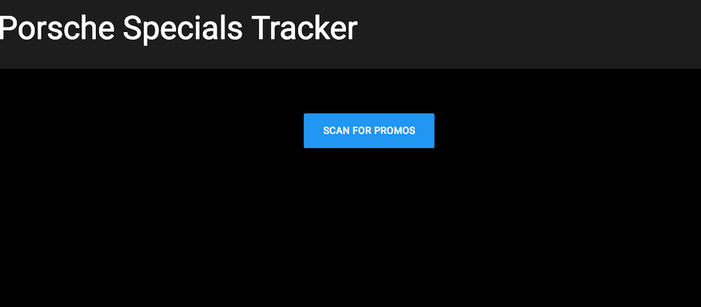
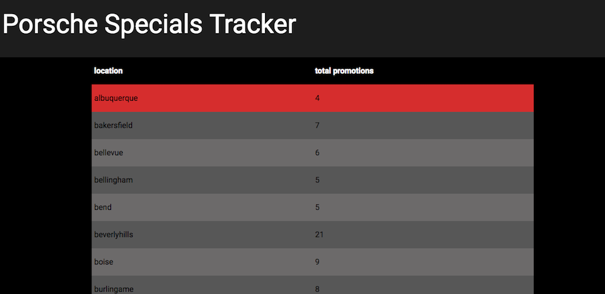
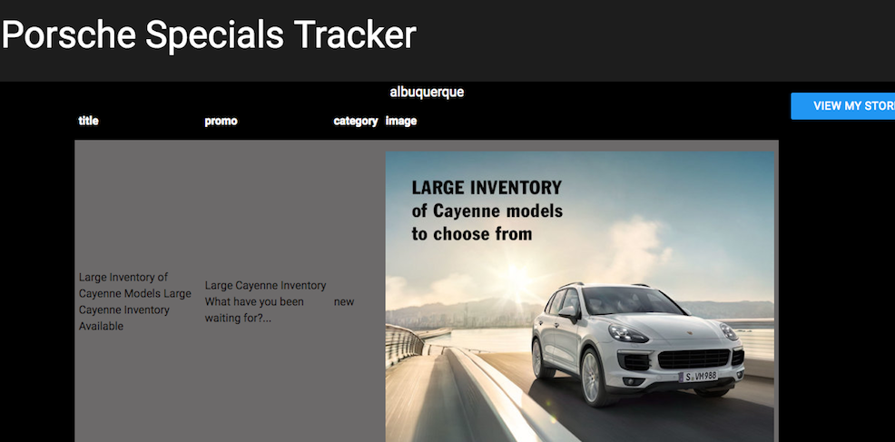

# Porsche Specials Tracker

Porsche Specials Tracker is a React application created for a district manager at Porsche to easily track and follow up with the promotions each of his dealerships is currently running by scraping the URLs of each dealership's "specials" page.

## Getting Started

These instructions will get you a copy of the project up and running on your local machine for development and testing purposes. See deployment for notes on how to deploy the project on a live system.

##Prerequisites

Ensure you have Mongo installed

### Installing

In the command line, begin running Mongo:

-mongod

In a seperate shell in the command line:

npm i

webpack -w

node server.js

### Landing Page

press scan button to run scrape and save all new promotions to the database

### All Stores

view all stores alphabetically or by number of promotions - stores with three or less appear in red. Click on store to view all store info.

### Store Info

View all store specials title, category and the image attached to the promotion

## Deployment

deployed on heroku with mlab

## Built With

* [React](https://facebook.github.io/react/) - The web framework used
* [MongoDB](https://www.mongodb.com/) - For datebase
* [Cheerio.js](https://github.com/cheeriojs/cheerio) - For web scraping
* [Materialize](https://getmdl.io/) - CSS framework

## Authors

* **Paige Pittman** - [paigepittman](https://github.com/paigepittman)
